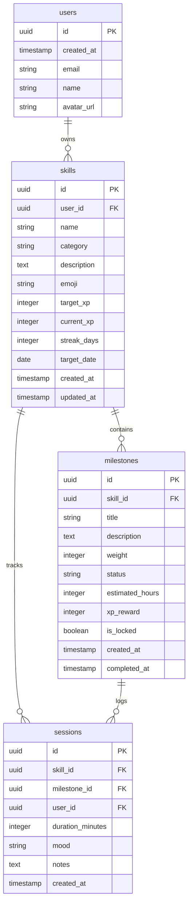

# 📰 Folio — Skill Tracker

> **Transform your learning journey with a beautiful newspaper-style skill tracking experience**

Ever struggled to stay motivated while learning new skills? **Folio** gamifies your personal development with a stunning newspaper aesthetic that makes tracking progress feel like reading your favorite morning paper.


## 🚀 [Live Demo](https://folio-demo.vercel.app) • [Report Bug](https://github.com/your-username/folio/issues) • [Request Feature](https://github.com/your-username/folio/issues/new)

---

## ✨ Why Folio?

Learning new skills should be exciting, not overwhelming. Folio combines the timeless elegance of newspaper design with modern gamification to create a delightful learning experience:

🎯 **Stay Motivated** - Watch your XP grow and maintain streaks  
📊 **Visual Progress** - Beautiful charts and milestone tracking  
🎨 **Aesthetic Design** - Newspaper theme with dark mode for night owls  
🔒 **Private & Secure** - Your data stays yours with Row Level Security  

---

## 🌟 Key Features

### 🎨 **Design & Experience**
- **📰 Newspaper Aesthetic** - Warm off-white backgrounds, elegant serif fonts (Playfair Display), and thin column borders
- **🌙 Wikipedia-Style Dark Mode** - Clean white text on charcoal for comfortable nighttime reading
- **⌨️ Typewriter Animations** - Page headings appear with a charming typewriter effect
- **📱 Fully Responsive** - Works beautifully on desktop, tablet, and mobile devices

### 🎮 **Gamification & Tracking**
- **🏆 XP System** - Earn experience points by completing milestones based on their weight
- **🔥 Streak Tracking** - Keep your practice streak alive and build consistency
- **📊 Visual Progress** - Beautiful charts showing your learning journey
- **🎯 Skill Categories** - Organize skills by music, fitness, learning, creative, or other

### 🛠️ **Functionality**
- **📝 Skill Management** - Create skills, set milestones, log practice sessions
- **🔗 Milestone Dependencies** - Lock/unlock milestones based on prerequisites
- **📅 Session Tracking** - Log practice sessions with mood, duration, and notes
- **🔐 Secure Authentication** - Sign in with Google or email/password

---

## 🛠️ Tech Stack

### ⚡ **Frontend**


### 🗄️ **Backend & Database**


### 🎨 **UI & Animation**


### 🚀 **Deployment**


---

## 📁 Project Structure

```
folio/
├── src/
│   ├── app/                 # Next.js 14 App Router
│   │   ├── (auth)/         # Authentication pages
│   │   ├── dashboard/      # Main application
│   │   └── globals.css     # Global styles
│   ├── components/         # Reusable UI components
│   │   ├── ui/            # Base UI components (shadcn/ui)
│   │   └── ...            # Feature components
│   ├── hooks/             # Custom React hooks
│   └── middleware.ts      # Next.js middleware
├── supabase/
│   └── migrations/         # Database schema migrations
├── public/                # Static assets
└── ...                    # Config files
```

---

## 🚀 Quick Start

### 📋 Prerequisites

- **Node.js** 18+ and npm
- **Git** for version control
- **Supabase** account (free tier is fine)

### 🛠️ Installation & Setup

#### 1. **Clone & Install Dependencies**

```bash
# Clone the repository
git clone https://github.com/your-username/folio.git
cd folio

# Install dependencies
npm install

# Copy environment variables
cp .env.local.example .env.local
```

#### 2. **Set Up Supabase**

<details>
<summary>🔧 Detailed Supabase Setup</summary>

1. **Create a new project** at [supabase.com](https://supabase.com)
2. **Get your credentials**: Project URL and anon key from Settings > API
3. **Run database migrations**:
   ```bash
   # Navigate to Supabase project > SQL Editor
   # Copy and run each migration file from supabase/migrations/
   ```
4. **Enable Google Auth**:
   - Go to Authentication > Providers
   - Enable Google provider
   - Add your Google OAuth credentials
5. **Set up Row Level Security** (migrations include this)

</details>

#### 3. **Configure Environment Variables**

Edit `.env.local` with your Supabase credentials:

```bash
NEXT_PUBLIC_SUPABASE_URL=your-project-url
NEXT_PUBLIC_SUPABASE_ANON_KEY=your-anon-key
```

#### 4. **Run Development Server**

```bash
npm run dev
```

🎉 **Open [http://localhost:3000](http://localhost:3000) to see your app!**

---

### 🔧 Troubleshooting

<details>
<summary>❓ Common Issues & Solutions</summary>

**Issue: "Database migration failed"**
- Ensure you're running migrations in the correct order (001, 002, 003)
- Check that all tables are created before enabling RLS policies

**Issue: "Google OAuth not working"**
- Verify your Google OAuth redirect URI matches: `https://your-project.supabase.co/auth/v1/callback`
- Ensure Google OAuth is enabled in Supabase Auth > Providers

**Issue: "Styling looks broken"**
- Run `npm install` to ensure all dependencies are installed
- Check that Tailwind CSS is properly configured

**Issue: "TypeScript errors"**
- Run `npm run build` to see detailed error messages
- Ensure all environment variables are set in `.env.local`

</details>

---

## 🗄️ Database Architecture

### 📊 Entity Relationship Diagram



### 🔐 Security Model

**Row Level Security (RLS)** ensures complete data isolation:

| Table | Access Rule | Purpose |
|-------|-------------|---------|
| `skills` | `user_id = auth.uid()` | Users can only access their own skills |
| `milestones` | `skill.user_id = auth.uid()` | Milestones must belong to user's skills |
| `sessions` | `user_id = auth.uid()` | Sessions are user-private |

### 📋 Schema Details

#### **Skills Table**
- **Categories**: `music`, `fitness`, `learning`, `creative`, `other`
- **XP System**: Track current XP vs target XP
- **Streak Tracking**: Daily practice streak counter
- **Visual Customization**: Emoji covers and optional target dates

#### **Milestones Table**
- **Weight System**: Must sum to 100% per skill
- **Status Flow**: `not_started` → `in_progress` → `completed`
- **Dependencies**: Lock/unlock based on prerequisite completion
- **Rewards**: XP calculated from weight × skill target XP

#### **Sessions Table**
- **Mood Tracking**: `great`, `okay`, `struggled`
- **Duration**: Session length in minutes
- **Notes**: Optional reflection text

---

## ⚙️ Configuration

### 🌍 Environment Variables

Create `.env.local` with:

```bash
# Supabase Configuration
NEXT_PUBLIC_SUPABASE_URL=your-project-url
NEXT_PUBLIC_SUPABASE_ANON_KEY=your-anon-key

# Optional: Google OAuth (if using)
GOOGLE_CLIENT_ID=your-google-client-id
GOOGLE_CLIENT_SECRET=your-google-client-secret
```

---

## 🚀 Deployment

### 🌐 Vercel (Recommended)

<details>
<summary>📋 Step-by-Step Vercel Deployment</summary>

1. **Push to GitHub**
   ```bash
   git add .
   git commit -m "Ready for deployment"
   git push origin main
   ```

2. **Import to Vercel**
   - Go to [vercel.com](https://vercel.com)
   - Click "New Project" and connect your GitHub account
   - Select your `folio` repository

3. **Configure Environment Variables**
   - Add your Supabase URL and anon key
   - Add any other required environment variables

4. **Deploy**
   - Click "Deploy" - Vercel will automatically build and deploy
   - Your app will be live at `your-project-name.vercel.app`

</details>

### 🐳 Docker Deployment

<details>
<summary>🐳 Docker Setup</summary>

```dockerfile
# Dockerfile
FROM node:18-alpine AS base
WORKDIR /app
COPY package*.json ./
RUN npm ci --only=production

FROM base AS builder
COPY . .
RUN npm run build

FROM base AS runner
COPY --from=builder /app/public ./public
COPY --from=builder /app/.next/standalone ./
COPY --from=builder /app/.next/static ./.next/static

EXPOSE 3000
ENV PORT 3000
CMD ["node", "server.js"]
```

```bash
# Build and run
docker build -t folio .
docker run -p 3000:3000 folio
```

</details>

### 🛠️ Other Platforms

- **Netlify**: Works with Next.js static export
- **AWS Amplify**: Full-stack hosting with CI/CD
- **DigitalOcean App Platform**: Simple container deployment

---

## 🤝 Contributing

We welcome contributions! Here's how you can help:

### 🎯 How to Contribute

1. **Fork the repository**
2. **Create a feature branch**: `git checkout -b feature/amazing-feature`
3. **Make your changes** with proper testing
4. **Commit your changes**: `git commit -m 'Add amazing feature'`
5. **Push to branch**: `git push origin feature/amazing-feature`
6. **Open a Pull Request**

### 📝 Development Guidelines

- **Code Style**: Follow existing TypeScript and Tailwind patterns
- **Components**: Use shadcn/ui components when possible
- **Database**: All schema changes must include migration files
- **Testing**: Add tests for new features
- **Documentation**: Update README for user-facing changes

### 🐛 Bug Reports

When reporting bugs, please include:
- **Description**: What happened and what you expected
- **Steps to Reproduce**: Clear reproduction steps
- **Environment**: Browser, OS, and version info
- **Screenshots**: If applicable

### 💡 Feature Requests

- Use the issue template for feature requests
- Describe the problem you're trying to solve
- Include any mockups or examples

---

## 🎯 Roadmap

### ✅ Completed
- [x] Basic skill tracking
- [x] XP and streak system
- [x] Newspaper aesthetic design
- [x] Google OAuth integration
- [x] Dark mode support

### 🚧 In Progress
- [ ] Mobile app companion
- [ ] Skill sharing and templates
- [ ] Advanced analytics dashboard
- [ ] Community features

### 📋 Planned Features
- [ ] Skill tree visualization
- [ ] Achievement badges
- [ ] Export functionality
- [ ] Integration with learning platforms
- [ ] AI-powered milestone suggestions

---

## ❓ FAQ

<details>
<summary>🤔 Frequently Asked Questions</summary>

**Q: Can I use Folio without Google OAuth?**
A: Yes! Folio supports email/password authentication as well.

**Q: How is XP calculated?**
A: XP is based on milestone weight × skill target XP. A 20% milestone completed gives you 20% of the skill's total XP.

**Q: Can I export my data?**
A: Currently, data export is in development. You can access your data through the Supabase dashboard.

**Q: Is Folio free to use?**
A: Yes! Folio is open source. You only pay for your Supabase hosting (free tier available).

**Q: Can I self-host Folio?**
A: Absolutely! The code is MIT licensed and can be self-hosted on any platform that supports Next.js.

</details>

---

## 📄 License

This project is licensed under the **MIT License** - see the [LICENSE](LICENSE) file for details.

---

## 🙏 Acknowledgments

- **Supabase** for the amazing backend-as-a-service platform
- **Vercel** for seamless Next.js deployment
- **shadcn/ui** for beautiful UI components
- **Framer Motion** for smooth animations
- **Tailwind CSS** for the utility-first CSS framework

---

## 📞 Get in Touch

- **🐛 Report Issues**: [GitHub Issues](https://github.com/your-username/folio/issues)
- **💬 Discussion**: [GitHub Discussions](https://github.com/your-username/folio/discussions)
- **📧 Email**: your-email@example.com
- **🐦 Twitter**: [@your-twitter](https://twitter.com/your-twitter)

---

<div align="center">

**⭐ Star this repo if it helped you!**

Made with ❤️ by [Your Name](https://github.com/your-username)

</div>
